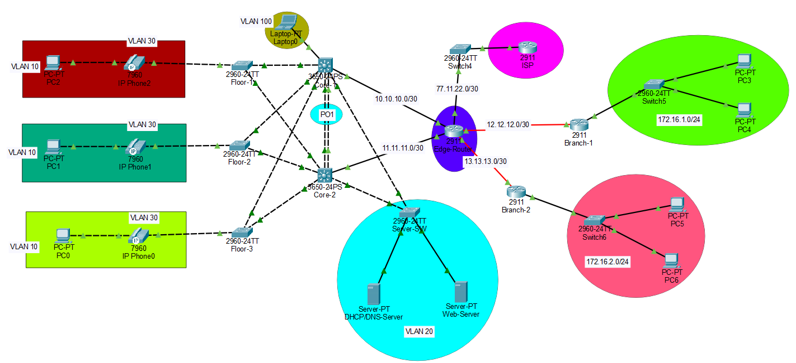

# CCNA Enterprise Network Design & Implementation

A simulated multi-site **Layer 2 + Layer 3 enterprise network** built in Cisco Packet Tracer, applying concepts from **CCNA Switching, Routing & WAN Technologies** with a focus on **high availability, security, and scalability**.

---

## 🧠 Lab Objectives

- Design and implement a **redundant core** with Layer 3 switching
- Configure **VLAN segmentation** for Data, VoIP, Server, and Management traffic
- Enable **VTP** for centralized VLAN management
- Implement **HSRP** for gateway redundancy
- Configure **EtherChannel (LACP)** between core switches
- Enable **Inter-VLAN routing** on multilayer switches
- Provide **DHCP services** to all VLANs with helper addresses
- Connect **branch offices** over WAN using static and floating static routes
- Apply **Port Security** and STP enhancements for loop prevention
- Ensure remote management via **SSH** on a dedicated management VLAN

---

## 🧰 Technologies & Protocols Used

- **VLANs**:  
  - VLAN 10 - Data  
  - VLAN 20 - Servers  
  - VLAN 30 - VoIP  
  - VLAN 100 - Management (SSH)  
- **VTP**: Server mode on cores for centralized VLAN control
- **HSRP**: Virtual gateway (.254) for all VLANs across both cores
- **STP**: Rapid-PVST with `portfast` and `bpduguard` on access ports
- **EtherChannel (LACP)**: Port-channel between cores (PO1)
- **802.1Q Trunking**: Core-to-access uplinks
- **Inter-VLAN Routing**: Layer 3 interfaces on cores
- **DHCP**: Centralized DHCP server with VLAN-specific pools & helper addresses
- **Static Routing**: Between branches, plus floating static routes for redundancy
- **Port Security**: Max 2 MAC addresses per PC port (PC + IP Phone), violation mode restrict
- **WAN**: Point-to-point /30 subnets between HQ and branch routers
- **WAN Point-to-Point Links (Core ↔ Edge Router)**:  
  - Core 1 ↔ Edge Router: 10.10.10.0/30  
  - Core 2 ↔ Edge Router: 11.11.11.0/30

- **Default Routing**: Unknown destinations routed to ISP

---

## 🖥️ Topology Overview

**Main Site:**
- 2× Cisco 3650-24PS core switches (Layer 3)  
- 3× Cisco 2960-24TT floor switches  
- DHCP/DNS Server & Web Server in VLAN 20  
- PCs and IP Phones in VLANs 10 & 30  
- Laptop in VLAN 100 (SSH management)  

**Branches:**
- Branch 1: Cisco 2911 Router, Cisco 2960 switch, PCs in `172.16.1.0/24`
- Branch 2: Cisco 2911 Router, Cisco 2960 switch, PCs in `172.16.2.0/24`
- WAN connectivity via point-to-point /30 links  

**Interconnections:**
- LACP Port Channel between cores (PO1)
- Trunk uplinks from core to access switches
- Static & floating static routing between HQ and branches
- Default route from HQ to ISP

---

## 📜 IP Addressing Plan

| VLAN  | Purpose         | Core 1 IP       | Core 2 IP       | HSRP Virtual IP |
|-------|----------------|-----------------|-----------------|-----------------|
| 10    | Data           | 192.168.10.253  | 192.168.10.252  | 192.168.10.254  |
| 20    | Servers        | 192.168.20.253  | 192.168.20.252  | 192.168.20.254  |
| 30    | VoIP           | 192.168.30.253  | 192.168.30.252  | 192.168.30.254  |
| 100   | Management     | 192.168.100.253 | 192.168.100.252 | 192.168.100.254 |

**WAN Links:**  
- HQ ↔ Branch 1: `12.12.12.0/30`  
- HQ ↔ Branch 2: `13.13.13.0/30`  
- HQ ↔ ISP: `77.11.22.0/30`

---

## 📌 Notes

- **Port Security** limits each access port to 2 MAC addresses (PC + IP Phone)  
- **BPDU Guard** enabled on all edge ports to prevent rogue switches  
- **DHCP Snooping** and helper addresses ensure correct IP allocation  
- Floating static routes provide backup paths if primary core fails  
- ISP default route ensures internet reachability for all sites

---

## 🚀 Skills Demonstrated

- Enterprise network segmentation & VLAN management
- Layer 3 redundancy using HSRP
- High availability using EtherChannel
- WAN design with point-to-point links
- Routing redundancy with floating static routes
- STP optimization with Rapid-PVST
- Network hardening with Port Security & BPDU Guard
- Centralized DHCP & DNS configuration
- Remote network management via SSH

---

## 📂 Repository Contents

- [ccna-project.pkt](ccna-project.pkt) - Cisco Packet Tracer topology file
- [Network_Diagram.png](Network_Diagram.png) - Logical topology diagram

---

## 🧑‍💻 Author

Rani Kamaleddine

[GitHub Profile](https://github.com/0xpynge)  

